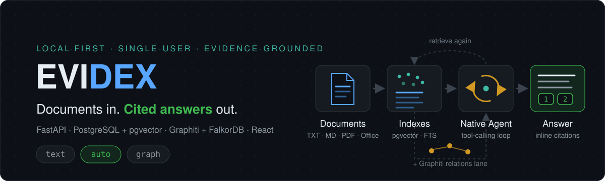
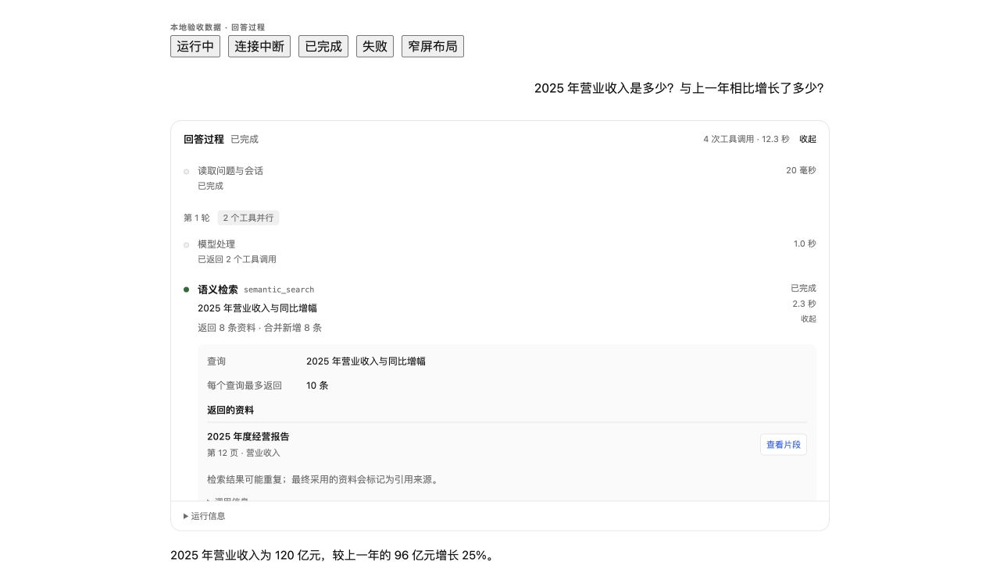
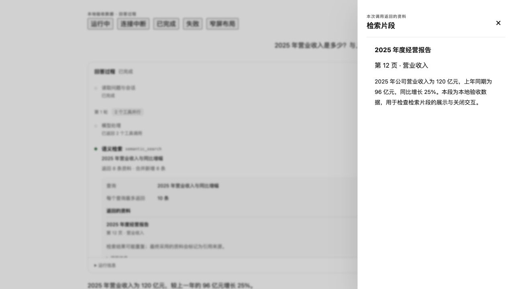
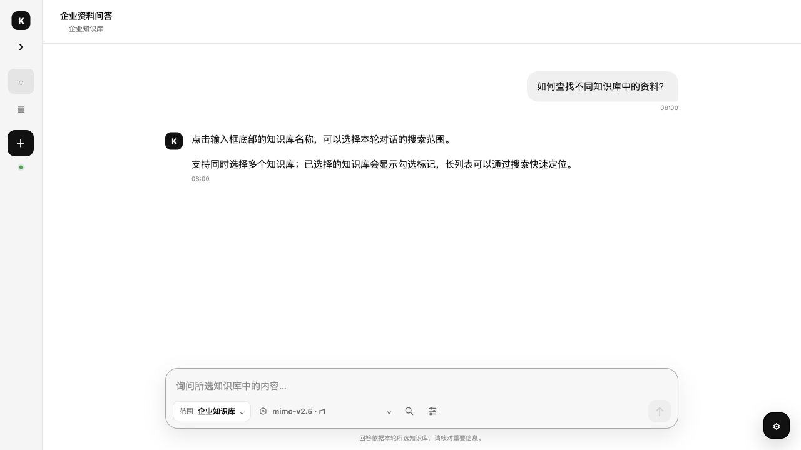
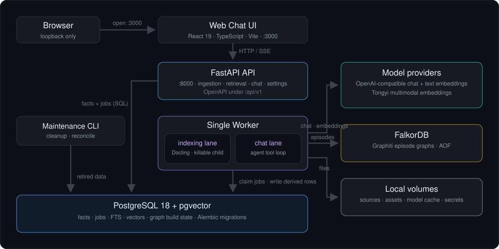

<div align="center">
  

  <p>
    
    
    
    
    
  </p>
</div>

<p align="center">
  <a href="README.md">English</a> · <a href="README.zh-CN.md">简体中文</a>
</p>

**Evidex** is a local-first, single-user personal knowledge base with
evidence-grounded RAG chat. Import your documents, let a worker parse, chunk,
and index them into pgvector (optionally into a Graphiti knowledge graph as
well), then ask questions and get plain-text answers whose every factual claim
carries an inline citation back to the exact source chunk. Everything runs on
your own machine via one Docker Compose command — your files, vectors, graph,
and chat history never leave the host.

> **Scope:** this is a personal, single-machine application, not a multi-tenant
> service. It has no production authentication or isolation and must stay on
> loopback. See [Security & scope boundaries](#security--scope-boundaries).

## Screenshots

<table>
  <tr>
    <td width="50%">
      
    </td>
    <td width="50%">
      
    </td>
  </tr>
  <tr>
    <td><sub>The answer process timeline: every tool call with its inputs, sources, result counts, and duration.</sub></td>
    <td><sub>The citation drawer: each reference opens the exact retrieved fragment behind it.</sub></td>
  </tr>
  <tr>
    <td colspan="2">
      
      <br/><sub>Multi-KB chat scope: pick any combination of knowledge bases per session; each run freezes its own scope.</sub>
    </td>
  </tr>
</table>

<sub>Screenshots show the real UI rendered with local acceptance-fixture data.</sub>

## What it is

Most RAG demos stop at "embed documents, stuff top-k into a prompt." Evidex is
built as a complete, inspectable local application around a stricter idea:
**an answer is only allowed to say what the evidence it cites actually
supports.** Retrieval, the agent loop, citation rendering, and persistence all
enforce that contract — and every internal step is observable in the UI and in
structured logs, so you can audit exactly why an answer says what it says.

It is deliberately a modular monolith for one maintainer: FastAPI + a single
worker + PostgreSQL, with clear import policy boundaries instead of
microservices.

## Highlights

### Document ingestion & indexing

- **8 formats**: TXT, Markdown (incl. `.mdz` bundles with local images), HTML,
  CSV, PDF, DOCX, PPTX, XLSX — parsed natively with Docling.
- **Bounded, resumable PDF parsing**: PDFs are parsed in deterministic page
  segments inside a worker-owned killable child process, with content-safe
  progress checkpoints between segments; OCR, layout, and table models stay
  enabled under a 6 GiB worker memory cap.
- **Structural or semantic chunking** (v5 profiles), table-aware row splitting,
  and optional visual assets (page / picture / table images).
- **Text-only, dual-space, or unified multimodal embedding** per knowledge
  base, with verified dimensions from 64 to 4096.
- **Optional Auto-QA index**: 0–5 generated questions per chunk, each
  independently verified against the source (SHA-256 + exact support spans).
  Questions only add recall candidates — they never become evidence, citations,
  or graph episodes.
- Failed candidates retry from the source file with bounded cleanup; serving
  indexes are never half-published.

### Retrieval

- **Exact pgvector cosine by default**; optional **hybrid** mode adds
  PostgreSQL FTS with deterministic RRF fusion behind one switch.
- **`iterative_balanced` strategy**: the agent runs up to two extra retrieval
  rounds anchored only on quoted spans from evidence it already received.
- **Rerank modes** `none | classic | local_minilm_v1` — the latter is a frozen,
  fully offline multilingual MiniLM INT8 ONNX reranker with windowed scoring of
  long chunks.
- Bounded table completion: adjacent table chunks from the same document
  version are pulled in as structural anchors without borrowing anchor scores.
- Cross-modal lanes query text and image spaces with role-bound, dimension-
  isolated vector records.

### Chat agent

- **One native async tool-calling loop — no agent framework.** The model calls
  `semantic_search`, `keyword_search`, `read_chunk_context`, `list_documents`,
  `search_graph_relations`, and `calculate`, with independent calls executed
  concurrently per round.
- **Evidence-only answers**: the final text cites inline `[ev_N]` refs that are
  resolved, validated against the frozen run scope, and renumbered to display
  `[1] [2]`; zero successful citations means the run is a refusal, not a
  guess.
- **A single token fuse** (`max_total_tokens`, default 400k) replaces
  per-call counters; when it trips, the agent switches to one tool-free
  wrap-up round. Retrieval closes after every selected KB stalls for two
  rounds.
- **Durable execution**: PostgreSQL `ChatRun` is the only execution state —
  attempts, heartbeats, and compare-and-set ownership make retries safe.
- **Live, content-safe progress**: an optional SSE transport streams per-call
  activity snapshots; the authoritative answer always comes from the terminal
  ChatRun.

### Knowledge graph (optional lane)

- **Graphiti on FalkorDB**: each serving chunk is ingested as one episode into
  immutable, generationed graph builds. A new build stages while the old READY
  build keeps serving, then switches atomically after coverage gates and a
  runtime probe pass.
- **Typed schema profiles**: `generic_open_domain_v1` (default),
  `software_knowledge_v1` (repos, services, licenses…), and
  `enterprise_knowledge_v1` (org, RACI, policy, systems…), frozen per build by
  key + digest.
- **Path-whole retrieval**: entity search resolves question entities, then
  node-distance / BM25 / vector / BFS search forms real, acyclic 1–3 hop paths;
  every hop maps back to a current serving chunk or the whole path is rejected.
- Graph calls are a first-class agent tool (`search_graph_relations`) with a
  90-second per-call timeout and safe result codes — never a hidden fallback.

### Multi-KB scope

- Select any combination of knowledge bases per chat session; each run freezes
  the exact KB set, index revisions, retrieval config, and graph builds.
- Citations keep a source snapshot (KB name + revision), and survive deletion
  of the original chunk.

### Observability & local ops

- One-command startup with a content-safe **doctor** preflight; revision-
  labelled images; frozen model artifacts verified by SHA-256 manifest.
- Versioned, secret-safe structured JSONL logs in `.runtime/logs`, a worker
  heartbeat, and a one-command diagnostics zip (health + allowlisted events
  only).
- Deterministic evaluation entry point with an offline `--dry-run` corpus
  check, plus layered unittest suites and a disposable-database integration
  runner.

## Why it is different

| Common pattern | Evidex |
| --- | --- |
| Prompt stuffed with top-k chunks | Per-claim evidence contract: invalid or unknown refs are dropped from both text and citation set; refusal is an explicit outcome |
| Framework agent black box | One plain async tool-calling loop with a frozen, inspectable budget and a persisted, bounded activity trace |
| "Hybrid" as a vague default | Exact vector is the default; hybrid FTS is an explicit switch with completeness manifests, and lexical hits never masquerade as cosine scores |
| Vector store as source of truth | PostgreSQL is the authority for facts, jobs, citations, and graph build state; vectors and graph are derived, rebuildable indexes |
| Reindex-the-world upgrades | Immutable index revisions and graph build generations stage in the background and switch only when complete; old READY builds keep serving |
| Provider config scattered in env | Model providers are validated and selected in the UI; secrets live in uncommitted local stores — there is no silent env fallback |

## Architecture



The system runs as a small set of local processes under one Compose project
(`rag`): PostgreSQL 18 + pgvector, FalkorDB, the FastAPI API, one Worker with
separate serial **indexing** and **chat** lanes, one-shot
storage-init/migration/maintenance tasks, and the React web chat frontend.

Key runtime principles:

- The API writes durable facts and returns fast; all model and parsing work
  happens in the worker.
- Job/run ownership is an incrementing `attempt` token with compare-and-set
  updates — stale workers can never overwrite newer terminal state.
- Every database operation is its own short explicit transaction; external
  model and file I/O never hold a transaction open.
- PostgreSQL is the source of truth for business and task state; local volumes
  hold source files and derived assets.

### Tech stack

| Area | Choice |
| --- | --- |
| Backend | Python 3.12, FastAPI, Pydantic, async SQLAlchemy, asyncpg, Alembic |
| Storage | PostgreSQL 18 + pgvector, PostgreSQL FTS, FalkorDB (Graphiti) |
| Parsing | Docling (native, with RapidOCR), deterministic page-segment PDF pipeline |
| Chat execution | Native async tool-calling loop; LangChain adapter for chat models |
| Models | OpenAI-compatible chat & text embeddings, Tongyi multimodal embeddings, offline MiniLM reranker |
| Frontend | React 19, TypeScript, Vite (`apps/web-chat`) |
| Ops | Docker Compose, structured JSONL logs, content-safe diagnostics |

### Repository layout

```text
apps/
  api/                 FastAPI HTTP layer, error mapping, composition root
  worker/              single-worker scheduling and composition root
  maintenance/         local cleanup commands
  web-chat/            React chat frontend (only frontend)

src/rag_kb/
  domain/              business types, states, errors
  schemas/             public API DTOs
  services/            use cases and cross-resource coordination
  answering/           native agent loop, evidence projection, validation, rendering
  document_processing/ Docling consumption, chunking, pure processing
  indexing/            indexing pipeline
  graph/               Graphiti builds, episode backfill, schema profiles
  retrieval/           retrieval and fusion
  scheduling/          PostgreSQL job scheduling
  memory/              session short-term context
  ports/               external I/O protocols
  adapters/            file, Docling, model, and retrieval store implementations
  repositories/ uow/ db/ config/ observability/

tools/                 local runtime doctor, smoke, reset, evaluation, DB test runner
tests/                 basic / unit / contract / integration suites
docs/                  architecture.md (single maintained architecture record)
```

Import direction is enforced by `architecture.toml` and verified in the basic
test suite — `domain/` depends on nothing infrastructural, SQL stays in
repositories, and SDKs stay in adapters.

## Quick start

**Prerequisites**

- Docker with Compose
- Python 3.12.13 on the host for tooling and tests (`doctor`, test suites,
  evaluators). The application itself runs in containers.
- Node 24 / npm 11 only if you want to hack on the frontend outside Docker.

**1. Configure the local manifest** (first setup only)

```bash
cp .env.example .env.local
# edit .env.local: replace every `replace-locally` database password consistently
```

`.env.local` is the single ignored manifest for Compose identity, loopback
ports, database bootstrap credentials, and `RAG_KB__...` application settings.
Model providers are **not** configured here — they are added in the UI later.

**2. Set up the host toolchain venv and run the doctor**

```bash
python3.12 -m venv .venv
.venv/bin/pip install -r requirements-dev-macos.lock   # macOS host tooling + tests

PYTHONPATH=src:. .venv/bin/python tools/local_runtime.py doctor
```

The doctor prints only projects, ports, and counts — it reports stale env files
or competing Compose projects without echoing any configuration value.

**3. Build and start**

```bash
make up
```

`make up` never guesses projects or ports and never rewrites your manifest:
it runs the content-safe doctor preflight, reconciles the declared database
roles, applies Alembic migrations, builds revision-labelled images (frozen
model artifacts verified by SHA-256 manifest), starts the services, and waits
for health. Existing volumes are retained. Run `make help` for the other
lifecycle targets (`down`, `ps`, `logs`, `migrate`, `smoke`, …).

**4. Open the app**

- Web Chat: <http://127.0.0.1:3000>
- API docs: <http://127.0.0.1:8000/api/v1/docs>

**5. Add your models, then chat**

A clean install ships with **no default model**. In Web Chat, open the model
settings (bottom right), add an OpenAI-compatible provider, add and validate a
chat model and a text embedding model (optionally a Tongyi multimodal
embedding), and select them for the workspace. Then create a knowledge base,
upload documents, wait for indexing, and ask a question.

## Configuration

Settings are strict and frozen: unknown fields are rejected, and the
application only accepts the `RAG_KB__...` namespace from `.env.local`. The
most relevant entries:

| Setting | Default | Purpose |
| --- | --- | --- |
| `RAG_KB_API_PORT` / `RAG_KB_FRONTEND_PORT` / `RAG_KB_POSTGRES_PORT` / `RAG_KB_FALKORDB_PORT` | `8000` / `3000` / `5432` / `6379` | Loopback ports |
| `POSTGRES_ADMIN_PASSWORD` / `RAG_KB_MIGRATION_PASSWORD` / `RAG_KB_RUNTIME_PASSWORD` | `replace-locally` | Database role bootstrap credentials (must be replaced) |
| `RAG_KB__RETRIEVAL__HYBRID_ENABLED` | `false` | Enable keyword search in Text/Auto chat and hybrid backfill for Graph mode |
| `RAG_KB__RETRIEVAL__MIN_COSINE_SIMILARITY` / `MIN_RERANK_SCORE` | `0.35` / `0.45` | Admission gates for dense and reranked candidates |
| `RAG_KB__CHAT_DELIVERY__PREVIEW_ENABLED` | `true` in the checked-in local profile | Best-effort live agent progress over SSE (terminal state always comes from the ChatRun) |
| `RAG_KB__JOB_POLLER__CHAT_DEADLINE_SECONDS` | `600` | Absolute ChatRun deadline |

Build-time download endpoints (Debian, PyPI, Hugging Face, npm) are overridable
via `RAG_KB_BUILD_*` variables; frozen revisions, lock files, and SHA-256
manifests still decide which bytes are accepted.

## Chat modes and retrieval strategies

**Chat modes** (per run, default `auto`):

| Mode | Behavior |
| --- | --- |
| `text` | Document-chunk tools only: semantic, keyword (when hybrid is enabled), and neighborhood context reads |
| `auto` | Text tools plus the first-class `search_graph_relations` tool whenever a READY graph build exists; the agent decides what to call |
| `graph` | Forced `retrieve_graph`: complete 1–3 hop graph paths are packed first, then unused budget is backfilled with hybrid document evidence |

**Retrieval strategies** (direct Retrieval Debug API, and Text mode where noted):

| Strategy | Behavior |
| --- | --- |
| `exact_vector` (default) | Single-round exact pgvector cosine over the current serving revision |
| `hybrid` | Dense + PostgreSQL FTS lanes fused with deterministic RRF; requires `HYBRID_ENABLED` and complete lexical manifests |
| `iterative_balanced` (Text chat) | Same exact-vector base; the agent runs at most two extra rounds whose queries must anchor on spans of already-issued evidence |

**Rerank modes**: `none` · `classic` (deterministic local ordering, the KB
default) · `local_minilm_v1` (offline MiniLM cross-encoder; `top_k` capped at
20 in chat).

## Knowledge graph builds

Graph indexing is opt-in per knowledge base and runs on the idle indexing
lane — it never steals capacity from document jobs:

1. Each serving chunk becomes exactly one Graphiti episode; episode UUIDs are
   deterministic (build + chunk + content hash), so retries never duplicate
   provider calls.
2. PostgreSQL stores the immutable build generation, the active pointer, the
   frozen schema profile key/digest, and the episode→chunk mapping.
3. A build becomes READY only after coverage gates and a runtime probe pass
   (zero self-loops, typed relations, connected aliases). The previous READY
   build keeps serving until the switch is atomic.
4. Switching the schema profile or changing frozen inputs requires a new build
   generation; explicit retry reuses the same build when nothing changed.

## Testing

```bash
# basic suite: imports and architecture boundaries (fast, no Docker)
PYTHONPATH=src:. .venv/bin/python -m unittest discover -s tests/basic -v

# unit + contract suites
PYTHONPATH=src:. .venv/bin/python -m unittest discover -s tests/unit -v
PYTHONPATH=src:. .venv/bin/python -m unittest discover -s tests/contract -v

# database integration: provisions a disposable loopback-only PostgreSQL
# container, runs migrations + the suite, and removes it in a finally cleanup
PYTHONPATH=src:. .venv/bin/python tools/run_database_tests.py

# frontend
cd apps/web-chat && npm ci && npm test && npm run build
```

Tests never build, pull, or tag images and never touch the personal `rag`
Compose project. Database tests only accept explicitly supplied disposable DSNs
(`RAG_KB_TEST_MIGRATION_DSN`, `RAG_KB_TEST_RUNTIME_SQLALCHEMY_DSN`) and fail
loudly instead of silently skipping.

## Operations

```bash
make ps
make logs        # SERVICES='api' to follow a single service
make smoke
make down
```

- Logs: application-safe JSONL under `.runtime/logs` (10 MiB × 5 rotation),
  correlated by `X-Trace-ID`, Run/Job IDs, and exception fingerprints.
- Diagnostics: one command exports the latest 72 h of allowlisted events plus
  health, Compose, and Git state to a private zip — never secrets, request
  bodies, or source lines.
- Reset (destructive): `tools/reset_local.py` permanently deletes the local
  business data volumes. Always run with `--inspect-only` first and re-run
  without it only for the exact confirmed target.

## Security & scope boundaries

This application is designed for **one user on one machine**:

- Everything binds to loopback; there is no production authentication, OIDC,
  ACL, multi-tenancy, or audit trail — do not expose it as a shared or
  internet-facing service.
- Provider keys, DSNs, and local passwords live only in uncommitted local
  files (`0600 .env.local`, model-secret volume); there is no environment
  fallback for model profiles.
- Documents, chat history, provider payloads, and image bytes are treated as
  untrusted content and are never written to logs; prompt content can never
  widen permissions or citation scope.
- File deletion and local data reset are destructive operations that require
  explicit confirmation with exact targets.

## Documentation

- [docs/architecture.md](docs/architecture.md) — the single maintained architecture record (Chinese)
- [README.zh-CN.md](README.zh-CN.md) — 简体中文项目说明

## License

No license file has been added yet; the code is currently all rights reserved
by the author. If you plan to accept contributions or make the repository
public, add a `LICENSE` first.
